# FinCommerce – Context-Aware E-Commerce Platform

[](https://opensource.org/licenses/MIT)
[](#)
[](#)

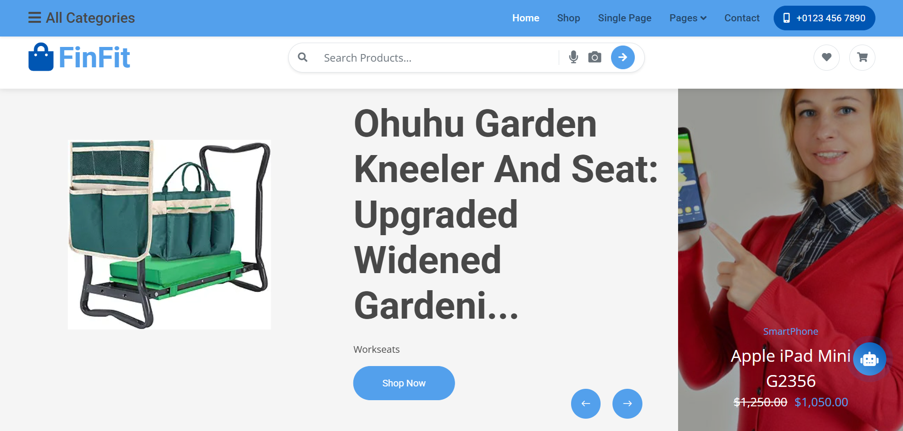

FinCommerce is an **intelligent e-commerce platform** designed to enhance product discovery
through **semantic search**, **image-based search**, and an **AI-powered RAG chatbot**.
The system also integrates a **financial-awareness layer**, enabling recommendations
that are aligned with user budgets and preferences.

---

## Table of Contents

- [Features](#features)
- [Interfaces](#interfaces)
- [Architecture](#architecture)
- [Technologies](#technologies)
- [Installation](#installation)
- [Usage](#usage)
- [Project Architecture](#project-architecture)
- [System Architecture](#system-architecture)
- [Requirement](#requirement)
- [Roadmap](#roadmap)
- [Evaluation](#evaluation)
- [Licensing](#licensing)
- [Show your support](#show-your-support)
---

## Features


- Modern design with purple gradient
- Real-time search
- Multilingual support (English, French, Arabic)
- Similarity score displayed for each result
- Clickable examples for quick testing
- Responsive and mobile-friendly
- Results show category and price


---

## Interfaces

### Front-Office
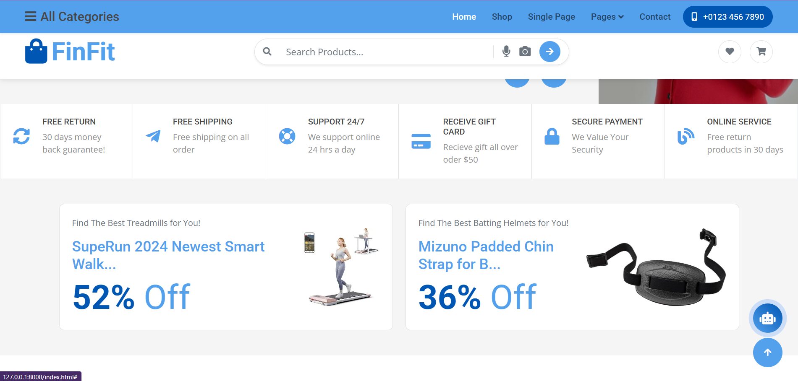

### Back-Office
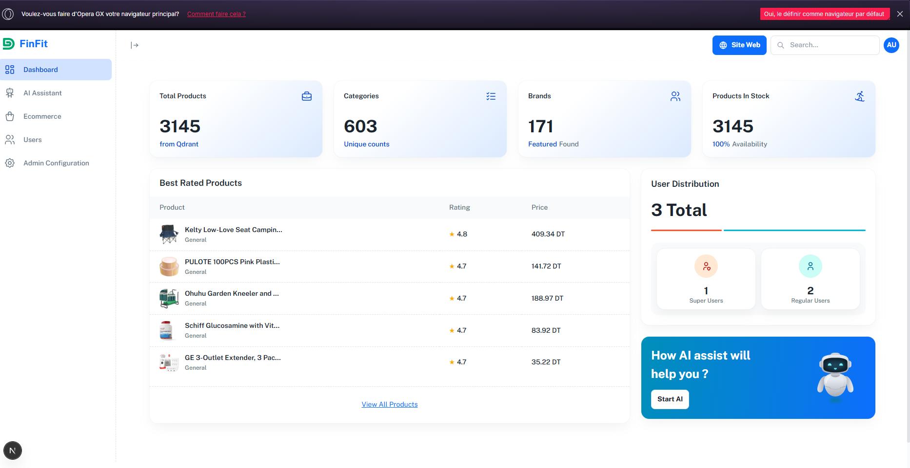


**Description:**  
The Front-Office allows users to browse the product catalog, perform intelligent searches,
and interact with the AI chatbot. Smooth and intuitive UX is prioritized.

### Semantic & Multimodal Search
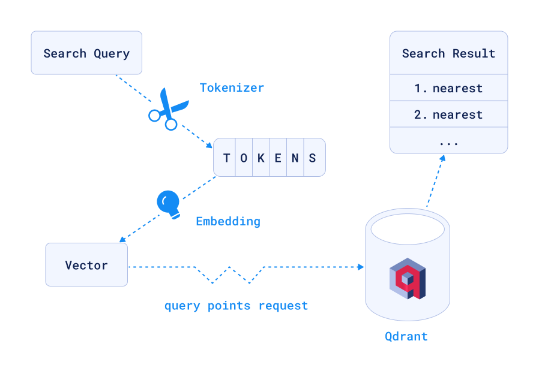

**Description:**  
Enables natural language queries and image-based discovery. Semantic and visual understanding improves product relevance.

### AI Chatbot (RAG)
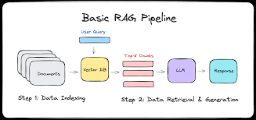
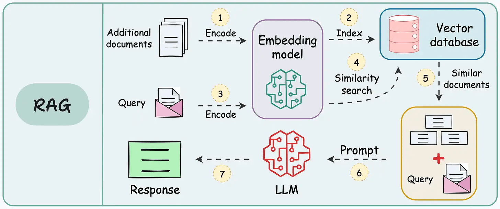

**Description:**  
Combines Qdrant vector retrieval with generative AI to provide contextual, financially-aware responses.


---

## Architecture
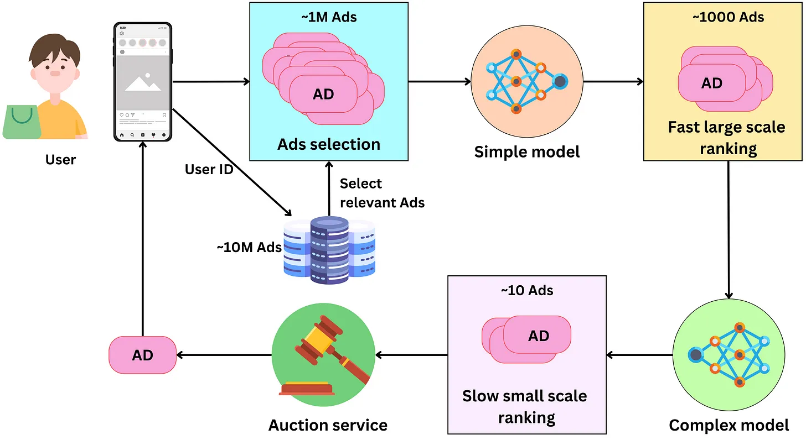
### High-Level Overview

**Description:**   
The platform consists of five main layers:

1. **Presentation Layer** – Front-Office & Back-Office  
2. **Intelligence Layer** – Semantic Search, Image Search, RAG Chatbot  
3. **Recommendation Layer** – Smart recommendations, query-less suggestions, financial-aware filtering  
4. **Vector Storage Layer** – Qdrant Cloud (embeddings + metadata)  
5. **Data & Model Layer** – Embedding Models & Product Dataset  

Qdrant stores text, image embeddings, and metadata for efficient similarity search and hybrid retrieval.


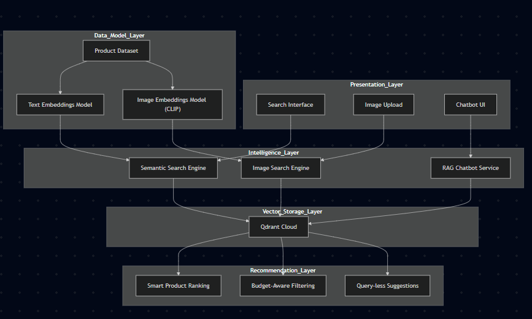
<details>
  <summary>Click to expand - Architecture RAG</summary>

### Architecture RAG

# RAG System – Architecture Schema

## 1. High-level system

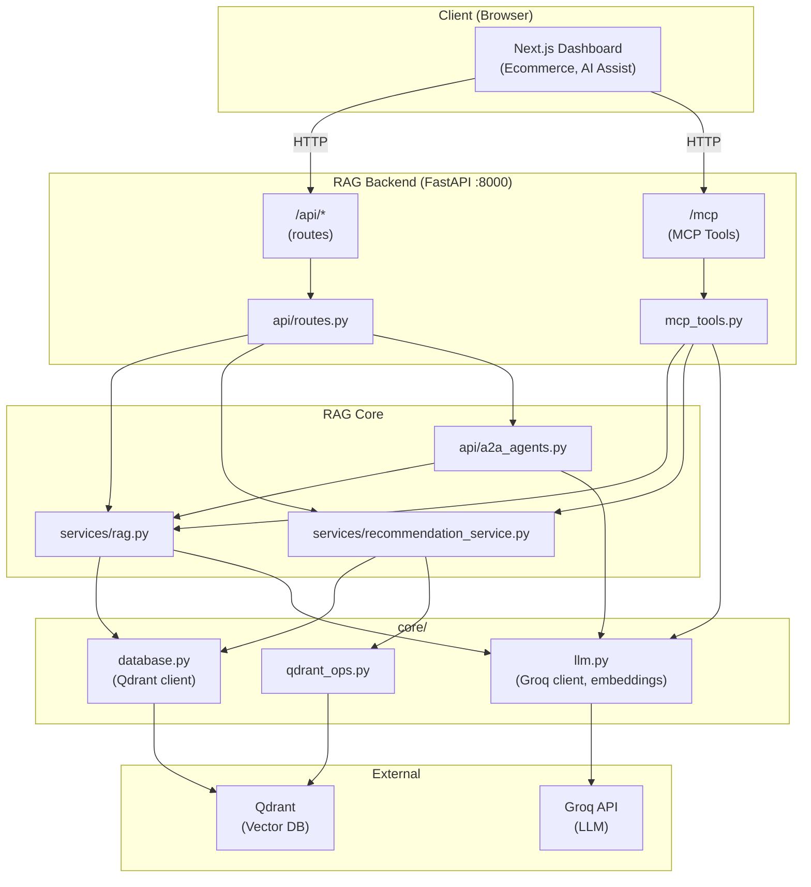

## 2. Backend modules

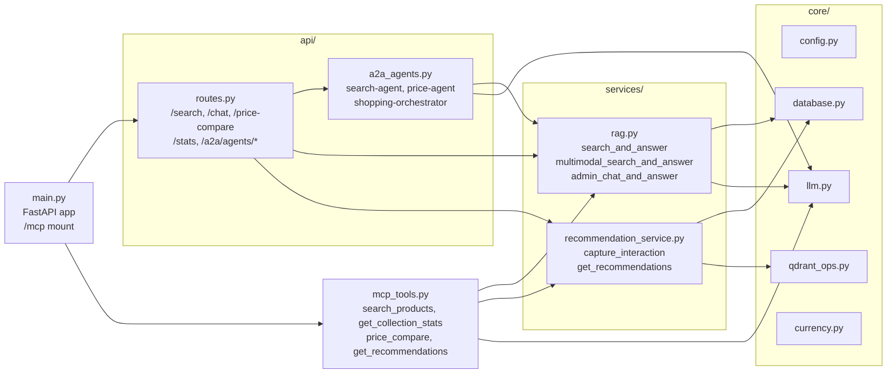

## 3. RAG search flow

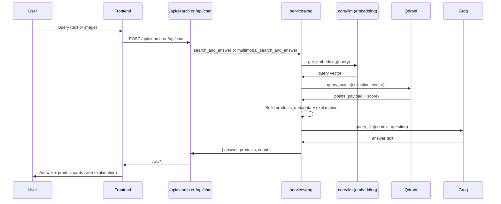

## 4. A2A agents (interconnected)

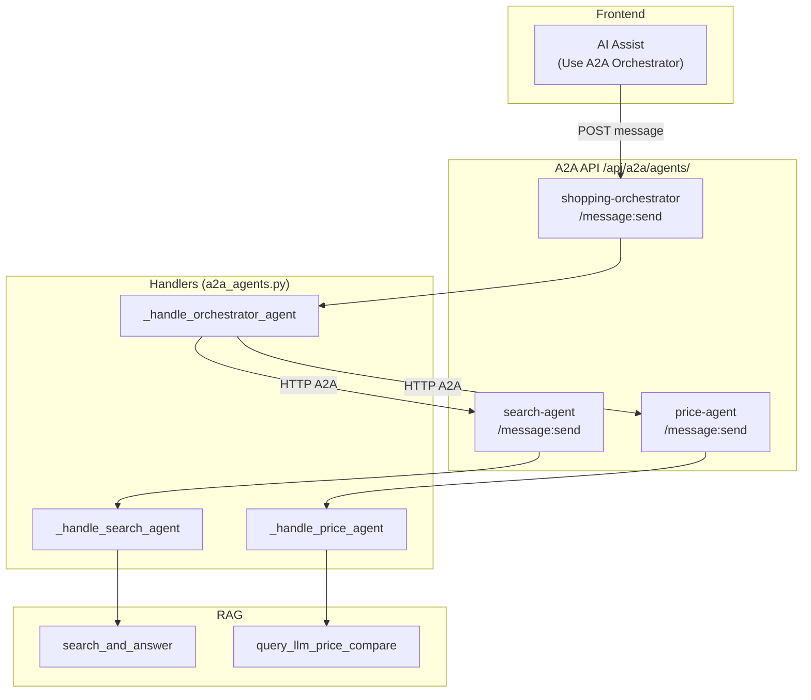

## 5. MCP tools

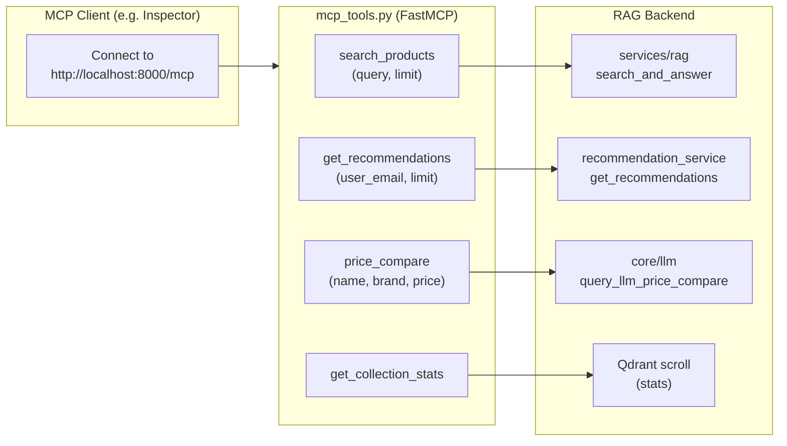

## 6. Data stores

```mermaid
erDiagram
    Qdrant ||--o{ Product : "collection"
    Qdrant ||--o{ UserProfile : "users collection"

    Product {
        string id
        vector text_dense
        vector image_dense
        payload name
        payload price
        payload brand
        payload category
        payload description
        payload availability
    }

    UserProfile {
        string user_email
        vector profile_vector
        payload budget
        payload preferred_categories
        payload interactions
    }

    Groq {
        string GROQ_API_KEY
        "chat.completions"
        "embeddings via SentenceTransformer"
    }
```

## 7. API surface (schema)

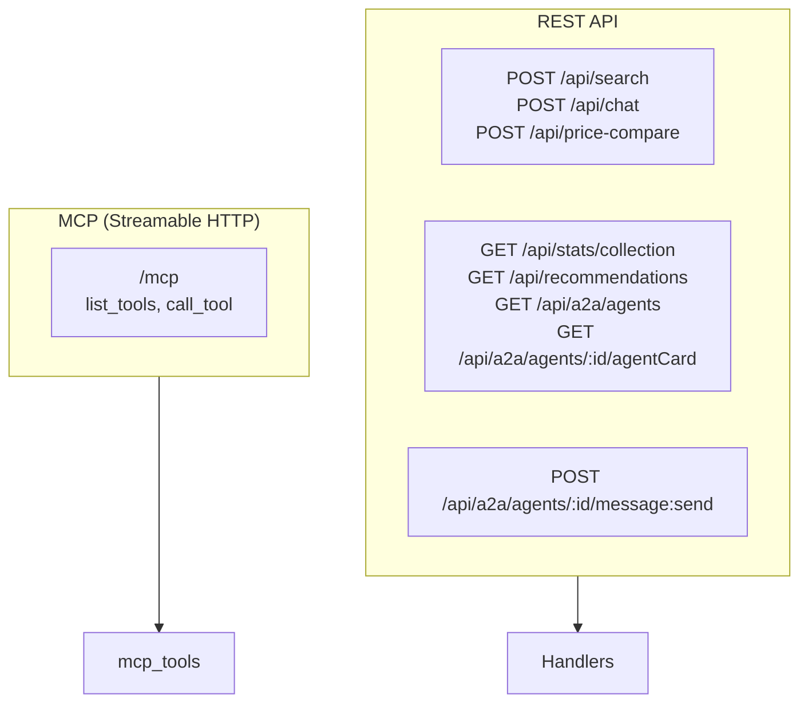


</details>


###  Agent Architecture Overview
#### 🔹 Core Agents (Always Active)

| Agent | Responsibility | Input | Retrieval Strategy | Output |
|------|---------------|-------|-------------------|--------|
| **Query Understanding Agent** | Interprets user intent and constraints | User query / product data | Semantic parsing + metadata extraction | Structured search intent |
| **Text Embedding Agent** | Encodes textual product information | Name, category, description | Dense embeddings (`all-MiniLM-L6-v2`) | Text vectors |
| **Image Embedding Agent** | Encodes product images | Product image (URL/Base64) | CLIP (`openai/clip-vit-base-patch32`) | Image vectors |
| **Multimodal Retrieval Agent** | Retrieves relevant products | Text + image embeddings | Vector similarity search (Qdrant) | Top-K candidates |
| **Fusion & Ranking Agent** | Combines text and image relevance | Text + image scores | RRF / weighted fusion | Ranked product list |
| **Context Filtering Agent** | Applies business constraints | Rating, category, availability | Metadata filtering | Valid candidate set |
| **RAG Context Builder Agent** | Builds LLM context | Retrieved products | Context window optimization | Prompt context |
| **Generation Agent (GROQ)** | Produces final response | Prompt + context | Deterministic LLM inference | Structured JSON output |

---

#### 🔹 Retrieval & Storage Agents

| Agent | Role | Technology | Data Handled |
|------|-----|-----------|-------------|
| **Vector Storage Agent** | Stores multimodal embeddings | Qdrant | Text + image vectors |
| **Indexing Agent** | Creates and updates indexes | Batch embedding pipeline | Product catalog |
| **Similarity Search Agent** | Executes nearest-neighbor search | Approximate NN search | Similar products |


#### 🔹 Recommendation Logic Agents

| Agent | Purpose | Method | Key Metrics |
|------|--------|-------|------------|
| **Relevance Agent** | Maximizes semantic similarity | Cosine similarity | Similarity score |
| **Diversity Agent** | Avoids near-duplicate results | MMR | Result diversity |
| **Quality Agent** | Promotes high-rated products | Rating-aware reranking | Avg rating |


#### 🔹 Output & Explainability Agents

| Agent | Function | Output |
|------|---------|--------|
| **Evidence Agent** | Attaches similarity evidence | Product ID, similarity score |
| **Explanation Agent** | Explains recommendations | Natural language reasoning |
| **JSON Structuring Agent** | Enforces output schema | Valid JSON response |


---

## Technologies

| Catégorie           | Technologie / Outil                   | Description Courte                   |
|--------------------|--------------------------------------|------------------------------------|
| Frontend           | HTML, CSS, JavaScript, Bootstrap      | Interfaces web réactives           |
| Backend            | Python (FastAPI / Flask)              | API et logique serveur              |
| AI & NLP           | Transformers, Vision-Language Models  | Recherche sémantique et embeddings |
| Vector Database    | Qdrant Cloud                           | Stockage et recherche vectorielle  |
| Data               | CSV, Pandas                            | Gestion des datasets produits       |
| Embeddings         | all-MiniLM-16-v2, splade, CLIP        | Textes et images multimodaux       |
| RAG Chatbot        | Langage & retrieval pipeline          | Génération augmentée par récupération |
| Dev & Environnement| Git, venv, pip                         | Gestion de projet et dépendances   |

---

## Installation

### Configure Environment
Create a .env file in the root directory:
```bash 
QDRANT_URL=https://<your-cluster>.cloud.qdrant.io
QDRANT_API_KEY=YOUR_QDRANT_API_KEY
QDRANT_COLLECTION=amazon30015

GROQ_API_KEY=YOUR_GROQ_API_KEY
GROQ_MODEL=llama-3.1-70b-versatile

```
### Installation
```bash
git clone https://github.com/karimmlayah/hackathon-Nexus
cd hackathon-Nexus-main
python3.11 -m venv venv 
venv\bin\activate 
or 
py -3.11 -m venv venv 
venv\Scripts\activate 
pip install -r requirements.txt
uvicorn app:app --reload --port 8001

```


---

## Usage


### Front-Office (User)
1. Open the interface in your browser:  
   - Go to [http://localhost:8001/](http://localhost:8001/)  
   - Or directly: [http://localhost:8001/static/search.html](http://localhost:8001/static/search.html)
2. Browse the product catalog or use the **semantic search bar** to find items.
3. **Test search queries** with examples:  
   - English: `wireless headphones`, `coffee maker`, `laptop backpack`, `smart watch`  
   - French: `machine espresso`, `casque bluetooth`, `sac à dos ordinateur`
4. **View search results**:  
   Each product displays:  
   - Product Name  
   - Similarity Score (0-100%)  
   - Category  
   - Description  
   - Price  
   - Product ID
5. Use image-based search to find visually similar products.
6. Interact with the **RAG chatbot** for personalized recommendations based on preferences and budget.
7. Apply financial filters to display only products within your price range
### Back-office (Admin)


The **Back-Office** is the Next.js dashboard (Dasher UI) used by staff to manage the catalog, run AI assistants, and view stats. It runs on **http://localhost:3000** when you start the frontend.

#### Accessing the Back-Office

1. **Start the RAG backend** (from project root):  
   `python run_server.py` → backend at **http://localhost:8000**
2. **Start the dashboard**:  
   `cd dasher-ui-1.0.0/dasher-ui-1.0.0` then `npm run dev` → dashboard at **http://localhost:3000**
3. Open **http://localhost:3000** in your browser. Sign in if the app uses auth (see project credentials).

#### Back-Office Sections (sidebar)

| Section | Path | Usage |
|--------|------|--------|
| **Dashboard** | `/` | Main dashboard overview. |
| **AI Assistant** | `/ai-assist` | Admin chat with the product collection: ask “How many products?”, “Percentage per brand”, “List all products”, or search-style questions. Product cards show **why each item is recommended** (explainable ranking). Toggle **“Use A2A Orchestrator”** to run interconnected agents (search + price compare). |
| **Ecommerce** | `/ecommerce` | Product table loaded from the RAG backend: **search** (filter by name, brand, category), **Price vs brand average** (click the dollar icon on a row to open a popup with Groq’s comparison). |
| **Users** | `/blog` | Users / content management (app-dependent). |
| **Admin Configuration** | `/admin` | Admin settings and user/role overview. |

#### Main actions in the Back-Office

- **Ecommerce**
  - Use the **search box** to filter products by name, brand, category, or description.
  - Click the **Price vs brand average** (dollar) button on a product row to see whether it’s more expensive than typical for that brand (Groq-based).
- **AI Assistant**
  - Ask collection questions (counts, categories, brands, list products) or search-style queries (“Find wireless headphones”).
  - Each product card shows an **explanation** (e.g. “Why recommended: matches your query ‘…’ (relevance: X%)”).
  - Enable **“Use A2A Orchestrator”** to use the interconnected agents (e.g. “Find headphones and tell me if any are overpriced”).

For full testing steps (including RAG and MCP), see **TESTING.md** in the project root.
## Project Architecture

```bash 

hackathon-Nexus-main/
│
├── finsite/                    # Django web application (main FinCommerce site)
├── static/                     # Front-Office static files (HTML, CSS, JS)
├── les_images/                 # Screenshots and architecture diagrams
│
├── app.py                      # FastAPI application entry point
├── manage.py                  # Application management and helper script
├── chatbot_service.py          # RAG chatbot logic and response generation
├── qdrant.py                  # Qdrant vector database client and queries
├── data.py                    # Dataset loading and preprocessing
├── embedder.py                # Text embedding generation
├── image_embedder.py          # Image embedding generation (CLIP)
│
├── reload_qdrant.py           # Reloads text embeddings into Qdrant
├── reload_qdrant_clip.py      # Reloads image embeddings into Qdrant
├── upload_multi_vectors.py    # Uploads text and image embeddings together
├── repair_vectors.py          # Repairs or realigns corrupted vectors
│
├── check_collection.py        # Checks Qdrant collection status
├── check_image_vectors.py     # Verifies image vector consistency
├── check_payload.py           # Validates vector payload structure
├── check_payload_simple.py    # Lightweight payload validation
├── check_vals.py              # Validates numeric values (price, scores)
├── inspect_text_payload.py    # Inspects text payload content
├── inspect_discount.py        # Checks discount metadata integrity
├── inspect_discount_v2.py     # Enhanced discount inspection logic
├── diag_image.py              # Image search diagnostic and testing
├── verify_repair.py           # Verifies vector repair operations
│
├── all_collections_detailed.json  # Metadata of all Qdrant collections
├── debug_payload.json             # Debug version of vector payloads
├── debug_payload_target.json      # Target payload for debugging
├── image_search_diagnostic.json   # Image search test results
├── sample_payloads.json           # Sample payloads for testing
│
├── multi_vector_embeddings.pkl    # Serialized multi-vector embeddings
├── db.sqlite3                     # Local SQLite database (testing)
│
├── payload_output.txt             # Text payload debug output
├── full_payload_dump.txt          # Full payload dump for inspection
│
├── requirements.txt               # Python dependencies
├── readme.md                      # Project documentation
└── .gitignore                     # Git ignore rules
```
## Requirement
- Python 3.9+
- GROQ API key
- Qdrant (Local or Cloud – free tier works)
## Roadmap

- Personalized experience that improves over time
- More accurate recommendations
- Human control when AI fails
- Fair and transparent results


## Evaluation 

#### Metrics & values

| Metric | Value | Where it applies |
|--------|--------|------------------|
| **Frontend port** | `3000` | Next.js dashboard (Dasher UI). |
| **Backend port** | `8000` | RAG API (FastAPI). |
| **Search results per request** | `12` (default), up to `100` in AI chat | RAG search, MCP `search_products`; AI Assistant sends `limit: 100`. |
| **Products per page (Ecommerce)** | `100` | Initial fetch from `GET /products?limit=100`. |
| **Products shown per “Show more”** | `12` | AI Assistant product list chunk (`INITIAL_PRODUCTS_SHOWN`, `SHOW_MORE_STEP`). |
| **Stats scroll cap** | `5,000` points | Admin chat & `GET /api/stats/collection`: scroll up to 5K points for category/brand stats. |
| **Collection stats sample** | `min(500, total)` – `5,000` | RAG admin context build. |
| **Recommendations per user** | `4` (default) | `get_recommendations`, MCP `get_recommendations`. |
| **LLM max tokens (admin answer)** | `1,024` | Groq admin/context response. |
| **LLM max tokens (price compare)** | `200` | Groq price comparison reply. |
| **QR code text max length** | `2,000` characters | `GET /api/qr?text=...`. |
| **Vector size** | `384` | Qdrant collection (e.g. all-MiniLM-L6-v2). |
| **Default collection** | `amazon30015` | Qdrant collection name. |
| **Relevance score** | `0%` – `100%` | Shown on product cards (explanation: “relevance: X%”). |
| **Budget default max (recommendations)** | `10,000` (currency units) | User budget when not set; internal cap up to `1,000,000`. |

#### Strengths

| Aspect | Evaluation |
|--------|------------|
| **Unified stack** | Single Next.js (Dasher UI) dashboard talking to one RAG backend (FastAPI + Qdrant). Clear separation between frontend (port 3000) and backend (port 8000). |
| **AI integration** | RAG for collection stats and search, Groq for natural-language answers and price comparison. Explainable ranking (relevance + "why recommended") on every product card. |
| **Agent-to-Agent (A2A)** | Optional orchestrator combines search and price agents in one chat turn. Good proof of concept for interconnected AI workflows in the back-office. |
| **Ecommerce UX** | Live product table from Qdrant, real-time client-side search (name, brand, category, description), and per-product price-vs-brand check via a clear action (dollar icon + modal). |
| **Operational coverage** | Covers catalog browsing, collection analytics (counts, percentages), semantic search, price guidance, and admin/user configuration in one place. |
| **MCP & testing** | RAG tools exposed via MCP (`/mcp`) and documented in **TESTING.md**, enabling automated or scripted testing of backend capabilities. |

## Licensing

This project is licensed under an Unlicense license. This license does not require you to take the license with you to your project.

## Show your support
Give a ⭐️ if this project helped you!